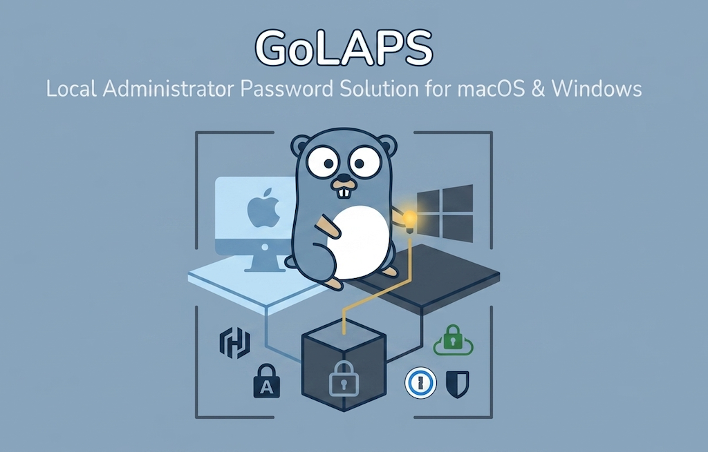

<p align="center">
  
</p>

# GoLAPS

GoLAPS rotates managed local administrator passwords for macOS and Windows fleets and stores the current credential in a selected vault provider.

The project is designed for MDM deployment, but the code is intentionally provider-neutral. Supported vault clients live in `internal/vault` and include 1Password, HashiCorp Vault, Bitwarden Secrets Manager, AWS Secrets Manager, and Azure Key Vault.

## Quick Start

Set the minimum required configuration:

```bash
export LAPS_ADMIN_USER="example-admin"
export LAPS_VAULT_TYPE="onepassword"
export LAPS_VAULT_ID="your-vault-id"
export LAPS_VAULT_TOKEN="your-vault-service-token"
```

Then build and run:

```bash
go build -o golaps ./cmd
./golaps
```

Provider-specific variables are documented in [docs/configuration.md](docs/configuration.md).

## Architecture

The rotation is built around one constraint: it is irreversible, and the vault holds the only copy of the result. The highlights:

- **Escrow-first**: the new password is staged in the vault *before* the device is touched, and the confirming write retires the staged copy. A run that dies mid-way is always recoverable.
- **The helper reports, Go decides**: privileged macOS operations live in a small Swift helper that returns a structured outcome (ok / od-error / auth-failed / locked / reset-refused / policy-rejected), and phantom `sysadminctl` resets — exit 0 while opendirectoryd refuses — are detected by output markers, never trusted by exit code.
- **Secure Token discipline**: token holders are never administratively reset; an unusable account is recreated through a heal ladder that bridges macOS's last-admin guard with a temporary admin. A failed token grant is a failed run, softened to a warning only when MDM recovery (a local personal recovery key + escrowed bootstrap token) covers the device.
- **Fleet-scale vault writes**: retries with random jitter, read-modify-write inside the retry, and a run budget that always reserves time for the final vault write.

Details: [docs/architecture.md](docs/architecture.md) · GUI prompt on privilege-managed Macs:
[docs/admin-by-request.md](docs/admin-by-request.md)

## Repository Layout

- [docs](docs) - public documentation.
- [configs/examples](configs/examples) - example environment and YAML configuration.
- [profiles/macos](profiles/macos) - example macOS configuration profiles.
- [scripts/build](scripts/build) - local build scripts.
- [scripts/mdm](scripts/mdm) - MDM execution and audit scripts.
- [cmd](cmd) and [internal](internal) - Go source code.

## GitHub Builds

This repository includes a GitHub Actions workflow at `.github/workflows/build.yml`.

From GitHub, open **Actions -> Build GoLAPS -> Run workflow**. The workflow uploads compiled artifacts for:

- macOS arm64 and amd64
- Windows amd64
- macOS Swift helper

## Security Notes

- Keep production `.env` files, MDM payloads, profiles, vault IDs, and service tokens outside the repository.
- Use placeholders in committed scripts and profiles.
- Rotate any credential that was ever committed before publishing.
- If old commits contain internal company names, admin usernames, vault IDs, tokens, or internal URLs, publish from a fresh clean repository or rewrite Git history first.
